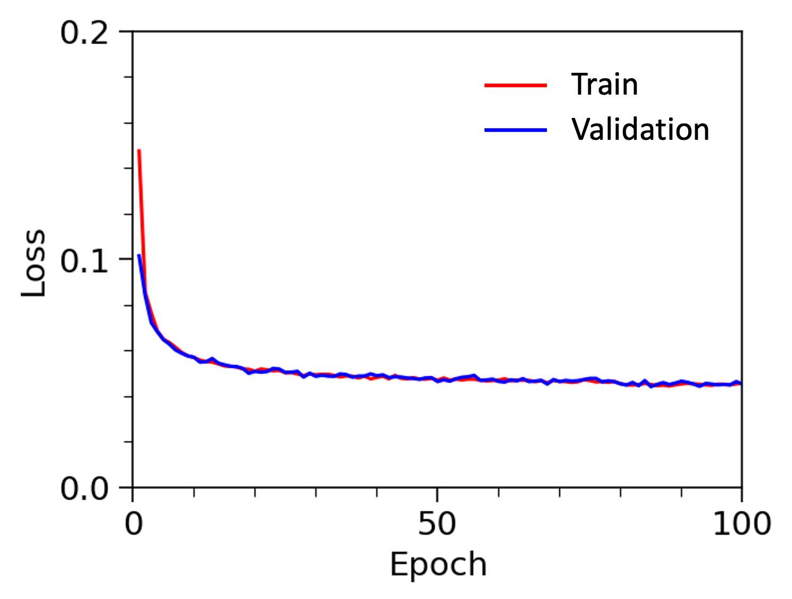

## General
This example demonstrates image generations using diffusion models. 

## Dataset
The dataset is CIFAR-10 from Torchvision. It consists of a train subset with 50K images and a test subset with 10K images. The image dimension is 32x32x3. There are 10 classes in the dataset. 80% and 20% train subset are used for training and validation, respectively. The entire test subset is used for evaluating the final model performance. 

Dataset Link: https://pytorch.org/vision/0.19/generated/torchvision.datasets.CIFAR10.html

## Model
The model is denoising diffusion probabilistic model, or diffusion model, which mainly includes a forward process and a backward process. The forward process adds guassian noises to the original images. The backward process predicts and removes the noises incrementally, converting pure noisy images into clean images. In this example, the U-net is applied to predict the noises during the backward processes. During training, a random noise at a random timestep is firstly added to the image, and the U-net is trained to predict that noise given the nosiy image and the timestep. During inference, the backward process last for 500 steps. At each step except for the final step, part of noise are removed with a new random guassian noise added.  

## Evaluation

**Figure 1. Loss on the train and validation dataset during training.**

| Timestep=0 | Timestep=100 | Timestep=200 | Timestep=300 | Timestep=400 | Timestep=500 |
|---|---|---|---|---|---|
|  |  |  |  |  |  |

**Figure 2. Forward process of adding noises incrementally to the original image.**

| Timestep=500 | Timestep=400 | Timestep=300 | Timestep=200 | Timestep=100 | Timestep=0 |
|---|---|---|---|---|---|
|  |  |  |  |  |  |

**Figure 3. Backward process of removing noises incrementally from the pure noisy image followig normal distribution.**

| Real Images | Fake Images |
|---|---|
|  |  |

**Figure 4. Demonstration of real images from the original dataset and fake images generated by the diffusion model.**

**Figure 5. FID score calculated from various number of real and fake images.**

Figure 1 shows the loss at different epoches on the train and validation dataset during training. Figure 2, 3 demonstrates the forward and backward process of the diffusion model. In the forward process, guassian nosies are incrementally added to the original clean images, which eventually turn into pure noises. In the backward process, the noises are gradually removed so that the images transform from pure noises into clean images. Figure 4 illustrates the 100 real images from the original dataset and 100 fake images generated from the diffusion model. Figure 5 shows the dependence of FID score on the number real/fake images used for the calculation. The FID gradually decreases and converges as the number of the images increases. The final FID score on the entire test dataset is 44.

## Reference
1. https://gymnasium.farama.org/index.html
2. Schulman, John, et al. "Proximal policy optimization algorithms." arXiv preprint arXiv:1707.06347 (2017).
3. https://pytorch.org/tutorials/intermediate/reinforcement_ppo.html
