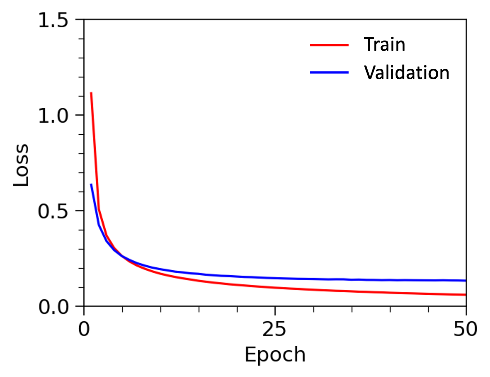
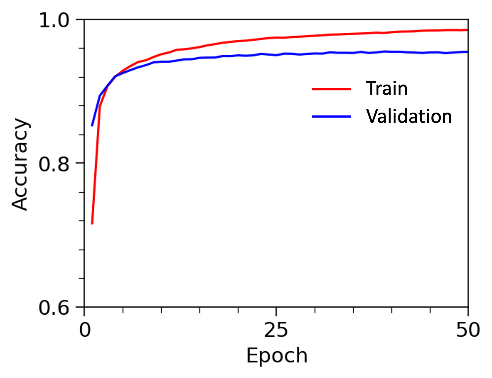

## General
This example mainly demonstrates the process of funetuning vision transformer model for classification tasks. 

## Dataset
The dataset is from Torchvison (https://pytorch.org/vision/main/generated/torchvision.datasets.EuroSAT.html) which consists of satellite land images with ten classes.

## Model
The model is the vision transformer (ViT) with a classification head (ViTForImageClassification). The classification layer weights are finetuned for 50 epoches, with all other model parameters frozen.

## Evaluation
 

Figure 1. Loss and accuracy on the train and valiation dataset. 

Figure 2. Confusion matrix for 10 classes.

| | Accuracy | Preciso | Recall | F1 | 
| --- | --- | --- | --- | --- |
| Train | 0.987 | 0.986 | 0.986 | 0.986 |
| Validation | 0.955 | 0.954 | 0.954 | 0.954 |
| Test | 0.957 | 0.955 | 0.955 | 0.955 |

## Reference
