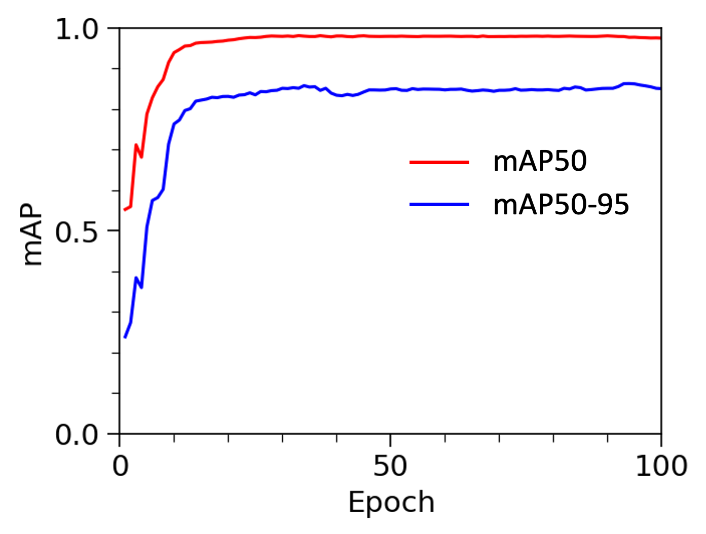
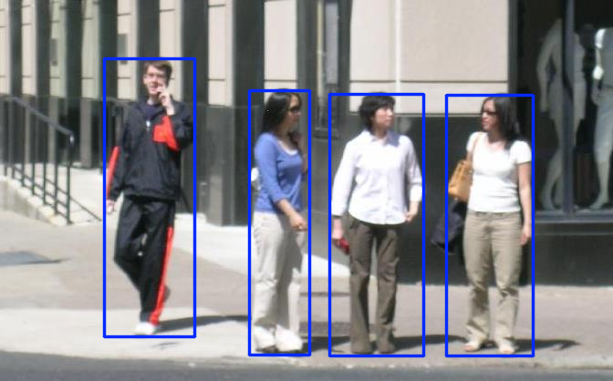
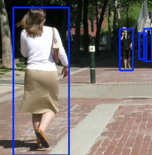

## General
This example demonstrates funetuning the YOLO model for object detection. 

## Dataset
The dataset is the Penn-Fudan Database which consists of 170 pedestrian images collected from University of Pennsylvania and Fudan University.

Dataset link: https://www.cis.upenn.edu/~jshi/ped_html/

## Model
The model is the YOLOv8 (You Only Look Once) with a detection head from Ultralytics. The weights in detection head are finetuned for 100 epoches, with all other model parameters in the backbone frozen.

## Evaluation

**Figure 1. mAP50 and mAP50-95 on the training dataset at various epoches.**

| | Precison | Recall | mAP50 | mAP50-95 |
| --- | --- | --- | --- | --- |
| Train | 0.960 (0.903) | 0.961 (0.943) | 0.988 (0.967) | 0.899 (0.842) |
| Valid | 0.927* (0.889) | 0.976* (0.951) | 0.980* (0.940) | 0.851* (0.835) |
| Test | 0.941* (0.936) | 0.949* (0.929) | 0.980 (0.981*) | 0.842* (0.830) |

| | Precison | Recall | mAP50 | mAP50-95 |
| --- | --- | --- | --- | --- |
| Train | 0.949 (0.862) | 0.976 (0.887) | 0.986 (0.896) | 0.600 (0.286) |
| Valid | 0.928* (0.868) | 0.987* (0.962) | 0.978* (0.927) | 0.636* (0.287) |
| Test | 0.963* (0.862) | 0.975* (0.940) | 0.982* (0.920) | 0.587* (285) |

**Table 1. Summary of various metrics on train/validation/test dataset from fintuned YOLO model. The metrics inside the brakets are from  the model before finetuning for comparison.**

    

**Figure 2. Examples of pedestrian detection on the test dataset.**

The original YOLO model exhibits a good performance on the detection task. With finetuning on around 100 images, the model performance get a slight improvement as shown in Table 1. 

## Reference
1. https://docs.ultralytics.com
2. Redmon, J. "You only look once: Unified, real-time object detection." Proceedings of the IEEE conference on computer vision and pattern recognition. 2016.
3. 
