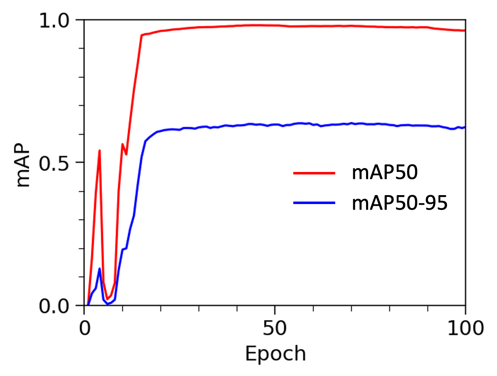
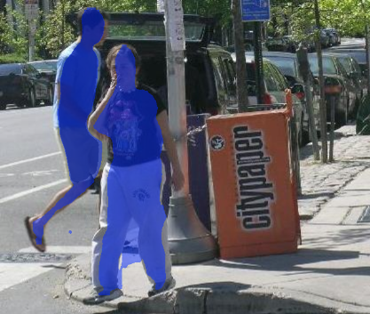
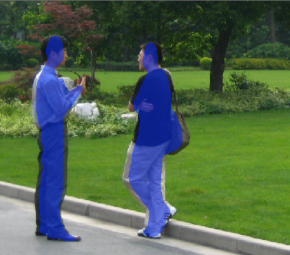

## General
This example demonstrates funetuning the YOLO model for instance segmentation. 

## Dataset
The dataset is the Penn-Fudan Database which consists of 170 pedestrian images collected from University of Pennsylvania and Fudan University.

Dataset link: https://www.cis.upenn.edu/~jshi/ped_html/

## Model
The model is the YOLOv8 (You Only Look Once) with a segmentation head from Ultralytics. The weights in segmentatio head are finetuned for 100 epoches, with all other model parameters in the backbone frozen.

## Evaluation

**Figure 1. mAP50 and mAP50-95 on the training dataset at various epoches.**

| | Precison | Recall | mAP50 | mAP50-95 |
| --- | --- | --- | --- | --- |
| Train | 0.949 (0.862) | 0.976 (0.887) | 0.986 (0.896) | 0.600 (0.286) |
| Valid | 0.928* (0.868) | 0.987* (0.962) | 0.978* (0.927) | 0.636* (0.287) |
| Test | 0.963* (0.862) | 0.975* (0.940) | 0.982* (0.920) | 0.587* (285) |

**Table 1. Summary of various metrics on train/validation/test dataset from fintuned YOLO model. The metrics inside the brakets are from  the model before finetuning for comparison.**

    

**Figure 2. Examples of instance segmentation of pedestrians on the test dataset.**

With finetuning on around 100 images, the model shows improvement on different metrics including precision, recall, mAP50 and mAP50-95, etc.

## Reference
1. https://docs.ultralytics.com
2. Redmon, J. "You only look once: Unified, real-time object detection." Proceedings of the IEEE conference on computer vision and pattern recognition. 2016.
